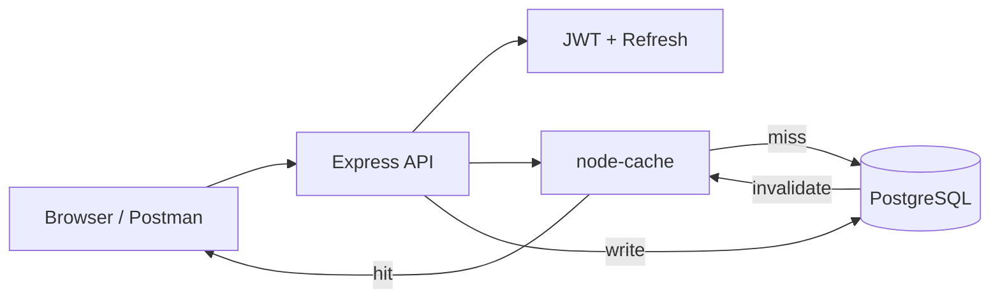

# Photo Caption Contest

[](https://github.com/Mahnoor-Zaffar/Photo-Caption-Contest/actions/workflows/ci.yml)

Full-stack photo caption contest: **JWT auth + refresh rotation**, **one-vote-per-image with transactions**, **read-through cache with >80% hit ratio under load**, **Playwright E2E + CI on PostgreSQL**.

> **Resume line:** JWT auth + refresh rotation, one-vote-per-image with transactions, read-through cache with >80% hit ratio under load, Playwright E2E + CI on PostgreSQL.

## Live Demo

| | Link |
|---|------|
| **App** | [photo-caption-api.onrender.com](https://photo-caption-api.onrender.com) |
| **Open contest (deep link)** | [City Skyline contest](https://photo-caption-api.onrender.com/?image=00000000-0000-4000-8000-000000000001) |
| **Swagger** | [/api-docs](https://photo-caption-api.onrender.com/api-docs) |
| **CI** | [GitHub Actions](https://github.com/Mahnoor-Zaffar/Photo-Caption-Contest/actions/workflows/ci.yml) |

> First request after idle on Render free tier may take ~50 seconds (cold start).

Built with Node.js, Express 5, PostgreSQL, and Sequelize — includes a Framer-inspired frontend, Swagger docs, Docker, and Render deployment.

## Features

- User registration, login, logout, and **refresh tokens** (httpOnly cookies + Bearer header)
- Protected caption submission and voting via JWT middleware
- PostgreSQL schema: Users, Images, Captions, and Votes
- **Sequelize transactions** on caption submit and voting (atomic vote counts)
- Paginated captions on `GET /api/images/:id` with `?sort=recent|votes` leaderboard
- In-memory response caching with **node-cache**
- Rate limiting on auth and vote routes, **helmet** security headers
- Structured logging with **pino**
- Interactive **Swagger** docs at `/api-docs`
- **Postman collection + environments** in `postman/`
- **GitHub Actions CI** with PostgreSQL service
- **Docker** support via `Dockerfile` and `docker-compose.yml`
- Framer-inspired **frontend** at `/` with token refresh, toasts, and sort tabs
- **One vote per image** — changing your pick moves the vote (DB-enforced)
- **Cache hit metrics** on `/api/health` (PRD target: >80% under load)
- **Graceful shutdown** on `SIGTERM`/`SIGINT` for zero-downtime deploys
- **Health probes:** `/api/health/live` (process up) and `/api/health/ready` (DB + cache)
- **Contest lifecycle:** images are `open` or `closed`; winner at `GET /api/images/:id/winner`
- **Structured error codes** (e.g. `CONTEST_CLOSED`, `VOTE_ALREADY_CAST`)
- **Refresh token rotation** with reuse detection (revokes all sessions on theft)
- **Denormalized `voteCount`** on captions with DB indexes for leaderboard reads
- **Caption XSS sanitization** on input; rate limits keyed by user ID after auth
- **Playwright E2E** + Jest integration tests in CI

## Architecture



**Read path:** `GET /api/images` checks cache → on miss, queries PostgreSQL → stores response.  
**Write path:** caption/vote transactions update DB + denormalized counts → cache keys invalidated.

## Demo Video

Record a ~60s walkthrough using [`docs/DEMO.md`](docs/DEMO.md):

1. Browse gallery → open an **open** contest  
2. Register → submit caption → logout  
3. Second user votes → “Your vote” badge appears  
4. Show `/api/health/ready` cache metrics  

<!-- Paste your link after recording -->
**[Recording script → docs/DEMO.md](docs/DEMO.md)**

## Tech Stack

- Node.js + Express 5
- PostgreSQL + Sequelize ORM
- bcrypt, jsonwebtoken, express-validator
- node-cache, helmet, express-rate-limit, pino
- Jest + Supertest + Playwright

## Prerequisites

- Node.js 18+
- PostgreSQL 14+

## Local Setup

```bash
npm install
cp .env.example .env
createdb photo_caption_contest
npm run db:migrate
npm run db:seed
npm run dev
```

- API: `http://localhost:8000`
- Swagger: `http://localhost:8000/api-docs`
- Frontend: `http://localhost:8000/`

### Contest images (seed data)

On first startup (or after `npm run db:seed`), five demo contest images are inserted from `src/seeders/20250628000001-demo-images.js`. Images use stable Picsum URLs and **fixed UUIDs** so README deep links stay valid:

| Contest | ID | Status |
|---------|-----|--------|
| City Skyline | `00000000-0000-4000-8000-000000000001` | open |
| Mountain Lake | `00000000-0000-4000-8000-000000000002` | open |
| Beach Sunset | `00000000-0000-4000-8000-000000000003` | open |
| Forest Trail | `00000000-0000-4000-8000-000000000004` | open |
| Desert Dunes | `00000000-0000-4000-8000-000000000005` | closed |

Local deep link example: `http://localhost:8000/?image=00000000-0000-4000-8000-000000000001`

To reset everything locally:

```bash
npm run db:reset
```

## API Endpoints

| Method | Path | Auth | Description |
|--------|------|------|-------------|
| GET | `/api/health/live` | No | Liveness probe |
| GET | `/api/health/ready` | No | Readiness (DB + cache metrics) |
| GET | `/api/health` | No | Alias for `/ready` |
| POST | `/api/auth/register` | No | Register a new user |
| POST | `/api/auth/login` | No | Login and receive tokens |
| POST | `/api/auth/refresh` | Cookie | Refresh access token |
| POST | `/api/auth/logout` | No | Logout and clear cookies |
| GET | `/api/auth/me` | JWT | Get current user profile |
| GET | `/api/images` | No | List all contest images (cached) |
| GET | `/api/images/:id` | No | Get image with paginated captions (`?sort=votes`) |
| GET | `/api/images/:id/winner` | No | Winning caption (closed contests only) |
| POST | `/api/images/:id/captions` | JWT | Submit a caption for an image |
| POST | `/api/captions/:id/votes` | JWT | Vote for a caption (one vote per image; moves if you change pick) |
| DELETE | `/api/captions/:id/votes` | JWT | Remove your vote |

## Postman Demo

1. Import `postman/Photo-Caption-Contest.postman_collection.json`
2. Import an environment:
   - **Local:** `postman/Photo-Caption-Contest.postman_environment.json`
   - **Production:** `postman/Photo-Caption-Contest-Production.postman_environment.json`
3. Run **Auth → Register** or **Login** — the collection saves `token` automatically
4. Run **Images → List Images** — copy an `id` into the `imageId` variable
5. Run **Captions → Submit Caption**, then **Votes → Vote for Caption**

## Testing

```bash
npm test              # unit + integration (Jest)
npm run test:e2e      # browser E2E (Playwright)
npm run load-test     # cache hit ratio benchmark
```

Unit tests run without a database. Integration and contest tests require PostgreSQL (CI runs migrate + seed automatically).

## Docker

```bash
docker compose up --build
```

Runs PostgreSQL + API on port 8000 with migrations and seeds applied automatically. Requires Docker Desktop with network access to pull images.

## Caching

- `GET /api/images` and `GET /api/images/:id` use read-through cache
- Cache keys include pagination and `sort` query param
- Authenticated image requests bypass cache (personal `myVoteCaptionId`)
- Default TTL: 60 seconds (`CACHE_TTL_SECONDS`)
- Cache invalidates when captions or votes change
- Hit/miss counters exposed on `GET /api/health` under `data.cache`

```bash
npm run dev          # terminal 1
npm run load-test    # terminal 2 — writes docs/load-test-results.md
```

See [`docs/load-test-results.md`](docs/load-test-results.md) for sample output.

## Design Tradeoffs

| Decision | Chosen | Alternative | Why |
|----------|--------|-------------|-----|
| **Votes** | One vote per image (`UNIQUE userId+imageId`) | One vote per caption | Matches real caption contests; vote *moves* instead of stacking |
| **Cache** | In-process `node-cache` | Redis | Simpler for single-instance Render free tier; sufficient for demo traffic |
| **Cache scope** | Skip cache when user is logged in | Cache everything | `myVoteCaptionId` is user-specific; anonymous reads stay fast |
| **Vote counts** | Denormalized `voteCount` column | SQL subquery on read | Faster leaderboard; updated atomically in vote transactions |
| **Auth** | JWT access + refresh (cookie + Bearer) | Sessions in Redis | Stateless API, works with Swagger and mobile clients |
| **IDs** | UUID v4 | Auto-increment integers | Safer in public URLs; no enumeration of contest entries |
| **Frontend** | Vanilla JS in `public/` | React SPA | Zero build step on Render; API remains the portfolio focus |
| **Migrations** | Run on Render build | Run on startup | Fails fast before traffic hits a broken schema |

## Deploy to Render

1. Push to GitHub
2. **New → Blueprint** → connect repo (uses `render.yaml`)
3. Set production secrets in the Render dashboard:
   - `JWT_SECRET` — strong random string (not a placeholder)
   - `JWT_REFRESH_SECRET` — different from `JWT_SECRET`
   - `DATABASE_URL` — provided by Render PostgreSQL
   - `NODE_ENV=production`

Build command: `npm ci && npm run db:migrate`  
Start command: `npm start`  
Health check path: `/api/health/ready`  
Seeds run automatically on startup when the images table is empty.

### Verify the correct app is deployed

After deploy, confirm the live service is **this** project (not a default Express scaffold):

```bash
curl -s https://photo-caption-api.onrender.com/api/health/live | jq .data.app
# Expected: "photo-caption-contest"
```

If you see HTML `<h1>Express</h1>` or `/api/images` returns 404 HTML, the Render service is pointing at the wrong repo, branch, or root directory. Reconnect the GitHub repo, ensure **Root Directory** is blank (repo root), and trigger **Manual Deploy → Clear build cache & deploy**.

## Engineering decision: one vote per image

Early voting allowed multiple votes on different captions for the same photo, which broke contest integrity. I added a `UNIQUE (userId, imageId)` constraint and **vote-move** semantics inside a transaction (decrement old caption count, increment new). This matches how real caption contests work and became a core README/interview talking point.

## What I Learned

- Designing REST APIs with validation, caching, and consistent error responses
- Sequelize transactions for race-safe voting and caption submission
- JWT access/refresh token rotation with httpOnly cookies
- Deploying Node.js + PostgreSQL on Render with migration-on-build
- Portfolio-grade DX: Swagger, Postman, CI, Docker, and a polished demo UI

## Project Structure

```
src/
├── config/          # Database, cache, logger, env, Swagger
├── controllers/     # Route handlers
├── middlewares/     # Auth, cache, rate limit, UUID validation
├── migrations/      # Sequelize migrations
├── models/          # Sequelize models and associations
├── routes/          # Express routes + Swagger annotations
├── seeders/         # Demo contest images
└── utils/           # ApiError, ApiResponse, asyncHandler
public/              # Frontend UI
postman/             # Postman collection + environments
docs/                # Demo script, load test results
tests/               # Jest + Supertest tests
e2e/                 # Playwright browser tests
.github/workflows/   # CI pipeline
```

## License

ISC
